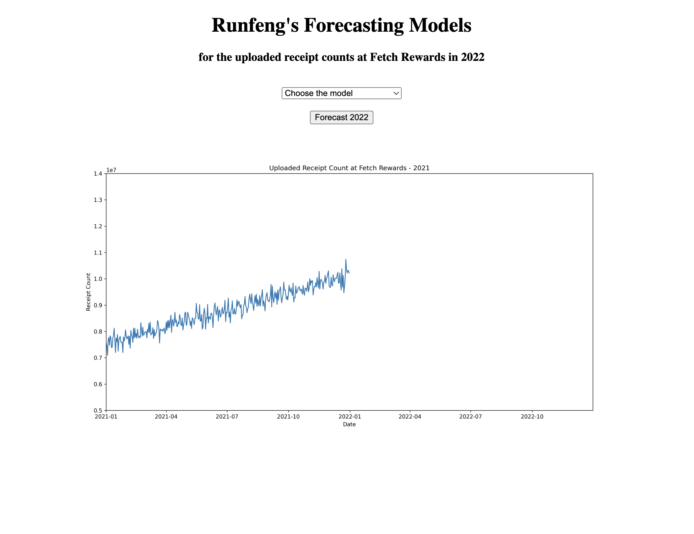
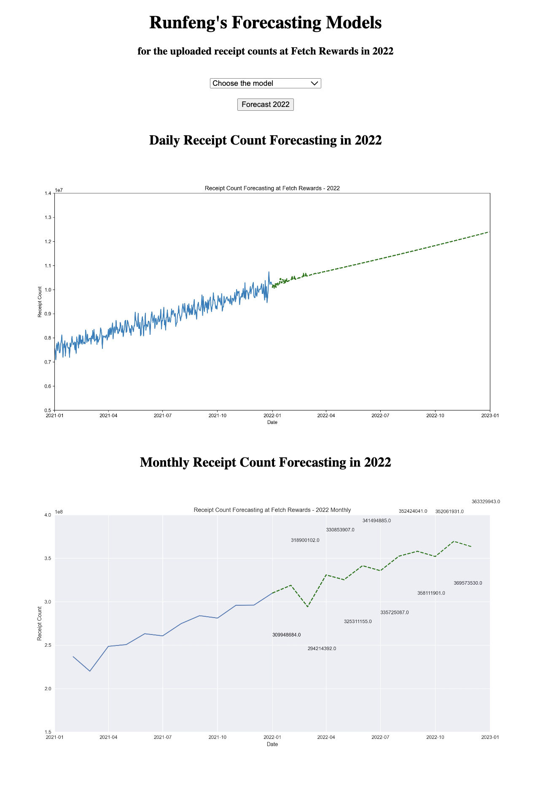
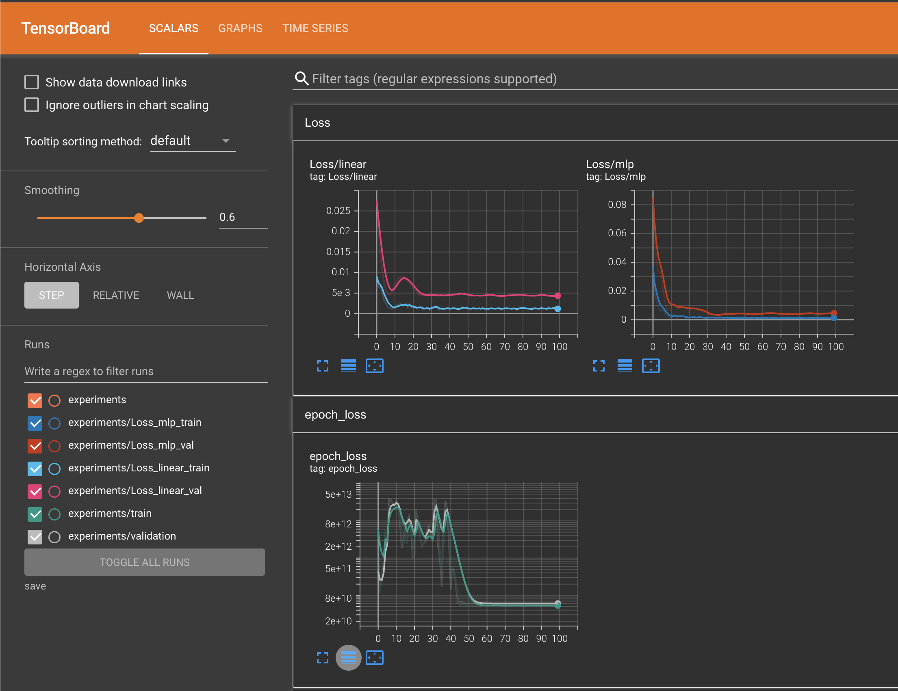

**Updates:**

- **02/Feb/2023** - To make the webpage smoother, I have commented out the 3 `os.system` lines in `app.py`.

# MLE Take Home Exercise - Fetch
Runfeng Li. 

If you have any question, please contact me via runfeng4[at]illinois[dot]edu.

**The codes have been tested on Mac system. I'm not sure if there would be any error on Windows**

## 1. Run the App
Turn on **Docker** on your computer (please make sure it's started not starting), and run the following commands to build and run the docker image. You may need to wait 5-10 minutes until this image finishes setting up.
```
git clone https://github.com/ranrandy/fetch-mle.git
```
```
cd fetch-mle
```
```
docker build -t forecast_app .
```
```
docker run -it -p 5001:5000 forecast_app
```
Next, go to [http://localhost:5001/](http://localhost:5001/) to visit the app. If you encounter any error that your port has been used, please change 5001 to any other numbers. For example, run `docker run -it -p 5002:5000 forecast_app`, and visit 
 [http://localhost:5002/](http://localhost:5002/).

Then you will see an interface like below



Click "choose the model", choose from "Linear Regression", "MLP", or "LSTM", and click "Forecast 2022" to get the animated predicted receipt count values (daily and monthly) in 2022, like below:

**<i> Note: After clicking "forecast 2022", the inference procedure will start running, during which a predicted result video will be saved. After that, the app would show that video. Because it may take a little while for the inference procedure to generate the animation, you would see the webpage "loading" for a little while.</i>**

**<i>If you don't want to wait that few seconds, you can go to the `app.py` file, and comment out those 3 `os.system()` lines. Then rebuild the image or don't use docker and run `flask run` at your local machine.</i>**



<!-- <video width="1000" width="800" control>
    <source src="static/save_eval/lstm_forecasting_2022_monthly.mp4" type="video/mp4">
</video> -->
You can see the monthly sum from the numbers around the line in the video.

### 1.1 Evaluation Metric Numbers

| Models         | MSE     | MAE | RMSE | R-Square
|--------------|-----------|------------|----|----|
| Linear Regression | **0.0394** | **0.0429** | **0.0800** | **0.0156** |
| MLP      | 0.1263  | 0.0778       |0.1483  |-0.0862|

**LSTM results are not shown here because after normalization, LSTM may be too complicated to train. Then if we don't norrmalize, the MSE, MAE, and RMSE will be very different from using normalized data**

**We can see that simple linear regression is the most efficient and accurate model for this dataset.**

---


## 2. Run the code by yourself

### 2.1 Requirements

- [Python >= 3.9](https://www.python.org/downloads/)

You also need a few packages, please run
```
pip install -r requirements.txt
```

### 2.2 Train and Test the models

#### 2.2.1 Linear Regression & MLP
```
python -m train.train --arch linear --date True --norm True --steps 100
```
```
python -m train.train --arch mlp --hidden_dim 10 --date True --norm True --steps 100
```

#### 2.2.2 LSTM (Including Inference)
```
python keras_lstm.py --arch lstm
```
You could try the below command. But you need to finetune some hyperparameters in the `utils/config.py` file. Otherwise, the results won't be good.
```
python -m train.train --arch lstm --norm True --steps 200
```
#### 2.2.3 Test-Only (Load Model Checkpoint)
```
python -m train.test --arch linear --date True --norm True --model_path 'save/linear_bs64_99.pth'
```
```
python -m train.test --arch mlp --hidden_dim 10 --date True --norm True --model_path 'save/mlp_hid10_bs64_70.pth'
```

### 2.3 Forecast 2022 Values (Inference / Evaluation)
```
python -m eval.eval --arch linear --date True --norm True --model_path 'save/linear_bs64_99.pth'
```
```
python -m eval.eval --arch mlp --date True --norm True --hidden_dim 10 --model_path 'save/mlp_hid10_bs64_70.pth'
```
```
python keras_lstm_inference_only.py --model_path 'save/lstm_in20_out1_hid40_100.h5'
```

### 2.4 Run the Flask App
Run the following command, and go to the returned web link.
```
flask run
```

### 2.5 Misc.
#### 2.5.1 Train/Val Loss Curve (TensorBoard)
In `save/experiments`, you will see my training log files, (and yours if you retrained the model). To visualize the loss curves, run
```
tensorboard --logdir=save
```
Go to the returned link, probably [http://localhost:6006/](http://localhost:6006/). Then you will see an interface like below:



I chose the model checkpoints based on the curves, 70 for MLP (right), 100 for Linear Regression (upper left), and 100 for LSTM (bottom).

#### 2.5.2 Exploratory Data Analysis
In `data/exploratory_data_analysis.ipynb`, I visualized some simple plots for this dataset, though the only takeaway was an linear positive relationship between the date and the receipt count.

#### 2.5.3 Test Cases
To test the implementation for `models.py` and `dataloader.py`, you can run
```
python -m utils.models
```
```
python -m utils.dataloader
```
Then you can check if the output are what you want.
